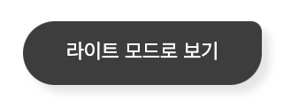

# DarkmodeButton

DarkmodeButton 컴포넌트는 도담도담 우측 하단에 존재하는 다크모드 버튼을 손쉽게 구현할 수 있도록 해줍니다.



## Props

| 속성 종류   | 속성 타입            | 속성 값     | 옵셔널 여부 |
| ----------- | -------------------- | ----------- | ----------- |
| onClick     | mouse event function | () => {}    | x           |
| isDark      | boolean              | true, false | x           |
| customStyle | css properties       |             | o           |

## Example

```tsx
//app.tsx
import { DarkmodeButton } from "@b1nd/b1nd-dodam-common-ui";

const App = () => {
  return <DarkmodeButton onClick={() => {}} isDark={true} />;
};
```
