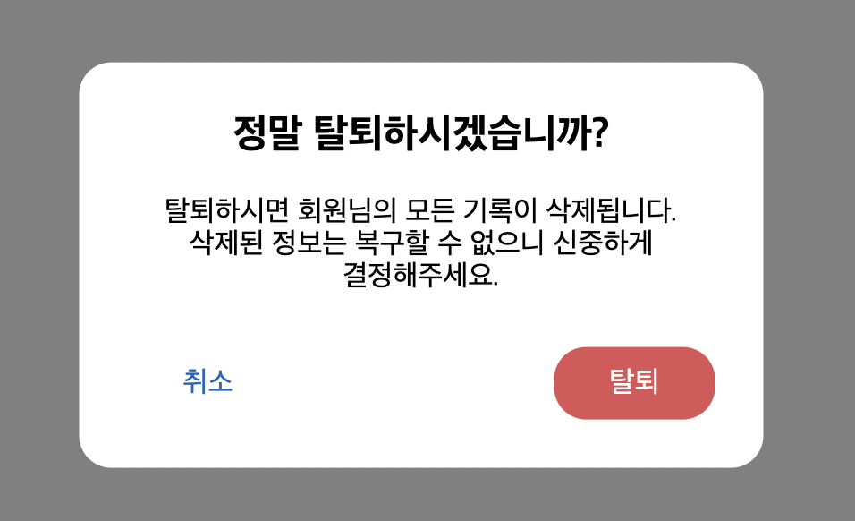

# Dialog

Dialog 컴포넌트는 Dialog를 손쉽게 구현할 수 있도록 해줍니다.



## Props

Dialog Props

| 속성 종류   | 속성 타입      | 속성 값     | 옵셔널 여부 |
| ----------- | -------------- | ----------- | ----------- |
| onClose     | void function  | () => {}    | x           |
| isOpen      | boolean        | true, false | x           |
| customStyle | css properties |             | o           |
| children    | react node     |             | x           |
| width       | number         | 0 ~         | o           |
| zIndex      | number         | 0 ~         | 0           |

Dialog Title Props

| 속성 종류 | 속성 타입  | 속성 값 | 옵셔널 여부 |
| --------- | ---------- | ------- | ----------- |
| children  | react node |         | x           |

Dialog Content Props

| 속성 종류 | 속성 타입  | 속성 값 | 옵셔널 여부 |
| --------- | ---------- | ------- | ----------- |
| children  | react node |         | x           |

Dialog Buttons Props

| 속성 종류 | 속성 타입  | 속성 값 | 옵셔널 여부 |
| --------- | ---------- | ------- | ----------- |
| children  | react node |         | x           |
| mainColor | string     | #0067bc | o           |

## Example

```tsx
//components/UserDeleteDialog.tsx

const UserDeleteDialog = () => {
  return (
    <Dialog zIndex={2} isOpen={isOpen} onClose={() => setIsOpen(false)}>
      <Dialog.Title>정말 탈퇴하시겠습니까?</Dialog.Title>
      <Dialog.Content>
        <p>
          탈퇴하시면 회원님의 모든 기록이 삭제됩니다. 삭제된 정보는 복구할 수
          없으니 신중하게 결정해주세요.
        </p>
      </Dialog.Content>
      <Dialog.Buttons>
        <button className="cancel">취소</button>
        <button className="error">탈퇴</button>
      </Dialog.Buttons>
    </Dialog>
  );
};
```
