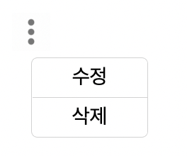

# MenuDropdown

MenuDropdown 컴포넌트는 보통 어떠한 게시물 옆에 있는 수정 삭제 드롭다운 UI를 손쉽게 구현해 줄 수 있도록 해줍니다.



# Props

| 속성 종류 | 속성 타입     | 속성 값  | 옵셔널 여부 |
| --------- | ------------- | -------- | ----------- |
| sizeType  | enum          | lg, md   | x           |
| onModify  | void function | () => {} | x           |
| onDelete  | void function | () => {} | x           |

# Example

```tsx
//app.tsx
import { MenuDropdown } from "@b1nd/b1nd-dodam-common-ui";

const App = () => {
  return <MenuDropdown sizeType="md" onDelete={() => {}} onModify={() => {}} />;
};
```
