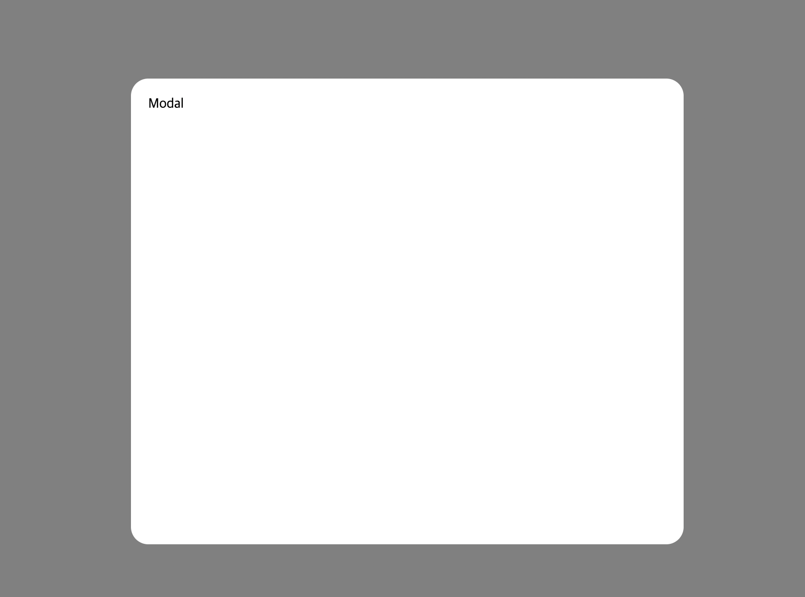

# Modal

Modal 컴포넌트는 모달을 손쉽게 구현할 수 있도록 해줍니다.



## Props

| 속성 종류   | 속성 타입                       | 속성 값     | 옵셔널 여부 |
| ----------- | ------------------------------- | ----------- | ----------- |
| width       | number                          | 0 ~         | x           |
| height      | number                          | 0 ~         | x           |
| zIndex      | number                          | 0 ~         | x           |
| isOpen      | boolean                         | true, false | x           |
| setIsOpen   | react set state action function | setState    | x           |
| children    | react node                      |             | x           |
| customStyle | css properties                  |             | x           |

## Example

```tsx
// app.tsx
import { Modal } from "@b1nd/b1nd-dodam-common-ui";
import { useState } from "react";

const App = () => {
  const [isOpen, setIsOpen] = useState(false);

  <Modal
    width={400}
    height={700}
    zIndex={10}
    isOpen={isOpen}
    setIsOpen={setIsOpen}
    customStyle={{ padding: 20 }}
  >
    <>Modal</>
  </Modal>;
};
```
