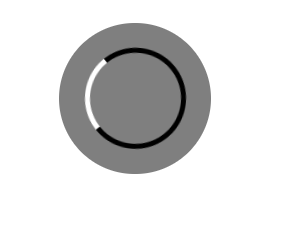

# Spinner

Spinner 컴포넌트는 로딩 스피너를 손 쉽게 구현할 수 있도록 해줍니다.



## Props

| 속성 종류  | 속성 타입 | 속성 값     | 옵셔널 여부 |
| ---------- | --------- | ----------- | ----------- |
| isAbsolute | boolean   | true, false | o           |
| isLoading  | boolean   | true, false | x           |

## Example

```tsx
// components/common/CustomSpinner.tsx

import { DarkmodeButton } from "@b1nd/b1nd-dodam-common-ui";

const CustomSpinner = () => {
  return <Spinner isAbsolute={true} isLoading={true} />;
};
```
