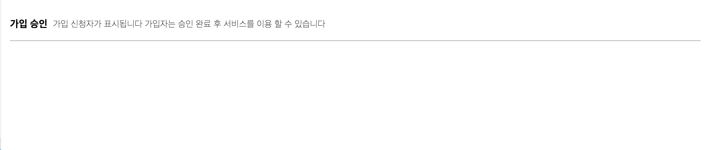

# SectionHeader

SectionHeader 컴포넌트는 게시물의 제목과 부제목을 손쉽게 구현해 줄 수 있도록 하는 UI 입니다.



# Props

| 속성 종류 | 속성 타입 | 속성 값 | 옵셔널 여부 |
| --------- | --------- | ------- | ----------- |
| subTitle  | string    |         | o           |
| title     | string    |         | o           |

# Example

```tsx
//app.tsx
import { SectionHeader } from "@b1nd/b1nd-dodam-t-common-ui";

const App = () => {
  return (
    <SectionHeader
      title="가입승인"
      subTitle="가입 신청자가 표시됩니다. 가입신청자는 승인 완료 후 서비스를 이용할 수 있습니다"
    ></SectionHeader>
  );
};
```
