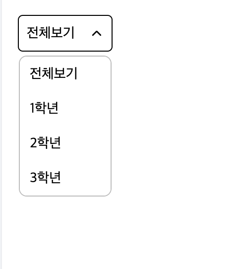

# Select

Select 컴포넌트는 보통 학생의 상태나 학년을 구분하기 위해 사용되는 UI입니다.



# Props

| 속성 종류 | 속성 타입 | 속성 값 | 옵셔널 여부 |
| --------- | --------- | ------- | ----------- |
| items     | array     | string  | o           |
| value     | string    |         | o           |
| onChange  | setState  | string  | o           |

# Example

```tsx
//app.tsx
import { SectionHeader } from "@b1nd/b1nd-dodam-t-common-ui";

const App = () => {
  return (
    <Select
      items={["전체보기", "1학년", "2학년", "3학년", "선생님"]}
      value={classification}
      onChange={setClassification}
      zIndex={2}
    />
  );
};
```
