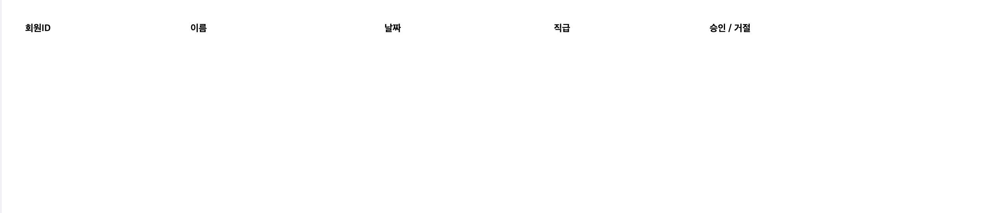

# Table

Table 관리자 프로덕트에서 많이 사용되는 테이블을 손쉽게 구현해 주는 UI 입니다.



# Props

| 속성 종류   | 속성 타입 | 속성 값 | 옵셔널 여부 |
| ----------- | --------- | ------- | ----------- |
| children    | string    | string  | x           |
| customStyle | cssObject |         | x           |

# Example

```tsx
//app.tsx
import { Table, THead, TH, TR } from "@b1nd/b1nd-dodam-t-common-ui";

const App = () => {
  return (
    <Table customStyle={{ width: 720 }}>
      <THead>
        <TR>
          <TH customStyle={{ width: 120, textAlign: "center" }}>사진</TH>
          <TH>이름</TH>
          <TH>반</TH>
          <TH>아이디</TH>
        </TR>
      </THead>
    </Table>
  );
};
```
